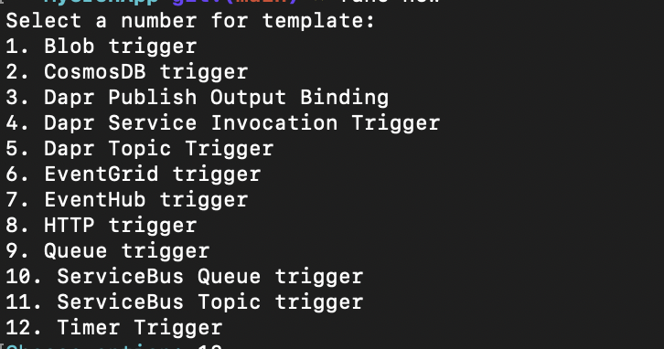

# Azure Functions Timer Trigger Demo

This repository demonstrates how to create and deploy an Azure Functions application with a Timer Trigger in Python. It serves as a template for building scheduled applications using CRON expressions.

## Features

- **Timer Trigger**: Executes functions based on a specified schedule.
- **CRON Support**: Flexible scheduling using CRON expressions.
- **GitHub Actions Deployment**: Automates deployment to Azure Functions.

## Prerequisites

1.	Python 3.10
2.	Azure Functions Core Tools ([Installation Guide](https://learn.microsoft.com/en-us/azure/azure-functions/functions-run-local?tabs=macos%2Cisolated-process%2Cnode-v4%2Cpython-v2%2Chttp-trigger%2Ccontainer-apps&pivots=programming-language-python))
3.	An Azure account ([Sign up for free](https://azure.microsoft.com/en-us/pricing/purchase-options/azure-account?icid=azurefreeaccount))

## Project Structure

The project structure is as follows:

```
MyCronApp/
├── function_app.py        # Contains the Timer Trigger function logic
├── host.json              # Azure Functions host configuration
├── requirements.txt       # Python dependencies
├── .github/
│   └── workflows/
│       └── deploy.yaml    # GitHub Actions workflow for deployment
└── images/
    └── options.png        # Image for documentation
```

## Setting Up the Project

1. Initialize the Project

After installing the Azure Functions Core Tools, initialize a new project:

```bash
func init MyCronApp --python
```

2. Add a Timer Trigger

Navigate to the project folder and create a Timer Trigger function:

```bash
cd MyCronApp
func new
```

When prompted, select the **Timer Trigger** option and define the **CRON schedule**.



3. Update `function_app.py`

The **Timer Trigger** function logic is implemented in `function_app.py`. A sample implementation is included in this repository:

```python
import azure.functions as func
import datetime
import logging

app = func.FunctionApp()

@app.timer_trigger(schedule="0 0 10 1 * *", arg_name="myTimer")
def main(myTimer: func.TimerRequest):
    if myTimer.past_due:
        logging.info('The timer is past due!')
    logging.info(f'Function executed at: {datetime.datetime.now()}')
```

This CRON expression runs the function at 10:00 AM on the first day of every month.

## Deploying to Azure

This project includes a GitHub Actions workflow for deploying the function to Azure Functions.

1. Set Up Azure

	1.	Create a Function App in Azure.
	2.	Download the Publish Profile from the Azure portal.
	3.	Add the publish profile to your GitHub repository as a secret named AZURE_FUNCTION_APP_PUBLISH_PROFILE.

2. Deploy with GitHub Actions

The deployment workflow is defined in `.github/workflows/deploy.yaml`. It automates the following steps:

- Install Python and dependencies.
- Deploy the application to Azure Functions.
